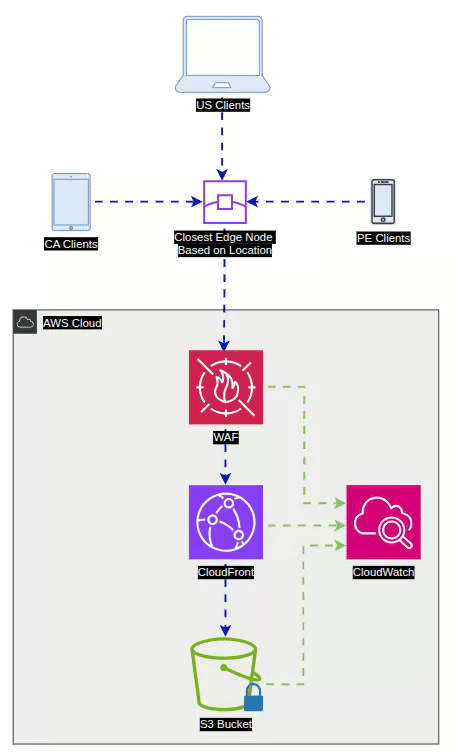
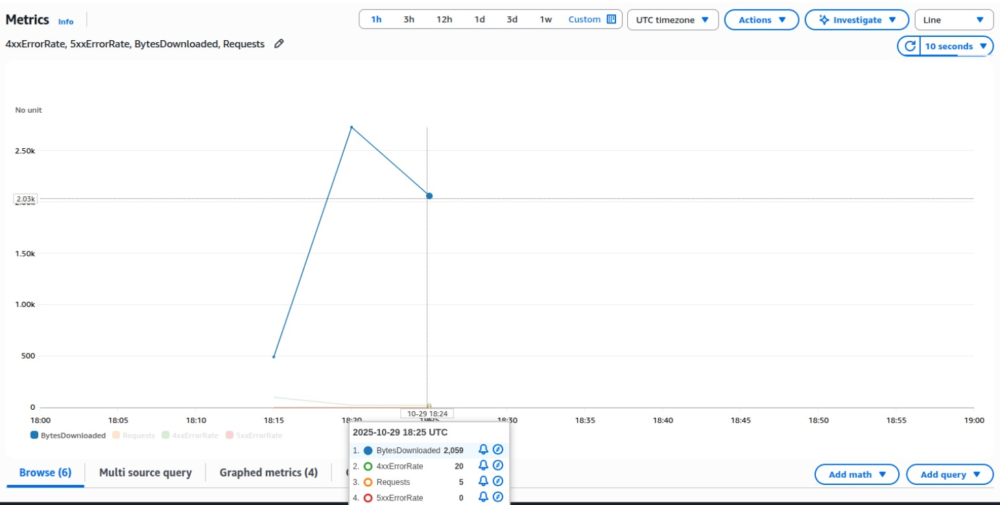

# `Hello AWS World!`

This project demonstrates the deployment of a **secure, globally-distributed static website** using **Amazon CloudFront**, **Amazon S3**, **AWS WAF**, and **Origin Access Control (OAC)** — fully provisioned using **AWS CloudFormation**.

The goal is to showcase best-practices in:
- Infrastructure as Code (IaC),
- CDN distribution,
- Secure origin protection,
- Observability, and
- Global low-latency delivery.

## 🏗️ Architecture Overview

The architecture implements:

- **Private S3 bucket** (no public access)
- **CloudFront** CDN as the only allowed access to the bucket
- **Origin Access Control (OAC)** to sign requests
- **AWS WAF** protection at the edge
- **CloudWatch** logging and metrics
- **Geo-restriction (US, CA, PE)**

<p align="center">
  
</p>

## 🌐 Global Content Delivery Flow

1. A user from the US, Canada, or Peru requests the site.
2. The request is routed to the **closest CloudFront edge location**.
3. AWS WAF inspects and filters traffic.
4. CloudFront forwards a **signed** request to S3 via OAC.
5. CloudFront caches content at the edge for performance.
6. CloudWatch receives metrics and logging data.

## ⚙️ Technologies Used

| Service | Purpose |
|---------|---------|
| Amazon S3 | Secure static content storage |
| Amazon CloudFront | Global CDN distribution |
| Origin Access Control (OAC) | Protects S3 from direct public access |
| AWS WAF | Web application filtering & security |
| AWS CloudFormation | Infrastructure as Code automation |
| Amazon CloudWatch | Metrics, observability, logging |

## 📁 Project Structure

```
├── assets
│   └── diagram.gif
├── config.js
├── index.html
├── README.md
├── script.js
├── static-website-tutorial.md
├── static-website.yml
└── styles.css
```

## 📄 CloudFormation Template

The infrastructure is deployed using the CloudFormation template below:

- Creates a private S3 bucket
- Configures Origin Access Control
- Deploys a CloudFront distribution
- Applies geo-restriction (US, CA, PE)
- Attaches a bucket policy locked to CloudFront

Full template: `static-website.yml`

## 🚀 Deployment Instructions

### 1. Upload the stack

AWS Console → CloudFormation → **Create stack**

- Upload `static-website.yml`
- Provide a unique `BucketName`

Deployment takes ~5 minutes.

### 2. Upload static website content

```bash
aws s3 cp index.html s3://<your-bucket-name>/
aws s3 cp styles.css s3://<your-bucket-name>/
aws s3 cp script.js s3://<your-bucket-name>/
```

### 3. Get the CloudFront URL

Navigate to **Outputs** in the stack to retrieve:

```
CloudFrontDomainName
```

Example:

```
https://d123abc4def567.cloudfront.net
```

## 🔐 Security Highlights

- **No public access** to S3
- **Block Public Access** enabled
- Traffic allowed **only** through OAC
- **HTTPS enforced**
- **AWS WAF** filters malicious traffic
- **Geo-restriction** limits eligible countries: US, CA, PE

### Automatically created S3 bucket policy

The CloudFormation stack creates and attaches an S3 bucket policy to restrict access to the bucket so only the CloudFront distribution (via Origin Access Control) can read objects. Keep this policy here for reference only.

Example auto-created bucket policy:

    {
      "Version": "2012-10-17",
      "Statement": [
        {
          "Sid": "AllowCloudFrontServicePrincipal",
          "Effect": "Allow",
          "Principal": {
            "Service": "cloudfront.amazonaws.com"
          },
          "Action": "s3:GetObject",
          "Resource": "arn:aws:s3:::<YOUR_BUCKET_NAME>/*",
          "Condition": {
            "StringEquals": {
              "AWS:SourceArn": "arn:aws:cloudfront::<YOUR_AWS_ACCOUNT_ID>:distribution/<YOUR_DISTRIBUTION_ID>"
            }
          }
        }
      ]
    }


## 📊 Observability

The architecture integrates with **Amazon CloudWatch**:

- Latency metrics
- Request counts
- Cache hit ratios
- Error rates

<p align="center">
  
</p>

## 🌎 Price Class Optimization

Using:

```
PriceClass_100
```

This reduces cost while serving North America efficiently.

## 🧹 Cleanup (to avoid charges)

1. Empty the S3 bucket
2. Disable CloudFront (wait until Deployed)
3. Delete the CloudFormation stack

## 📚 Documentation References

- https://docs.aws.amazon.com/cloudfront
- https://docs.aws.amazon.com/s3
- https://docs.aws.amazon.com/waf
- https://docs.aws.amazon.com/cloudformation
- https://docs.aws.amazon.com/cloudwatch

## 🎯 Learning Objectives

✅ Infrastructure as Code (CloudFormation)

✅ Secure static hosting patterns

✅ CDN caching and compression

✅ Origin Access Control (OAC)

✅ Edge security with WAF

✅ Observability with CloudWatch
